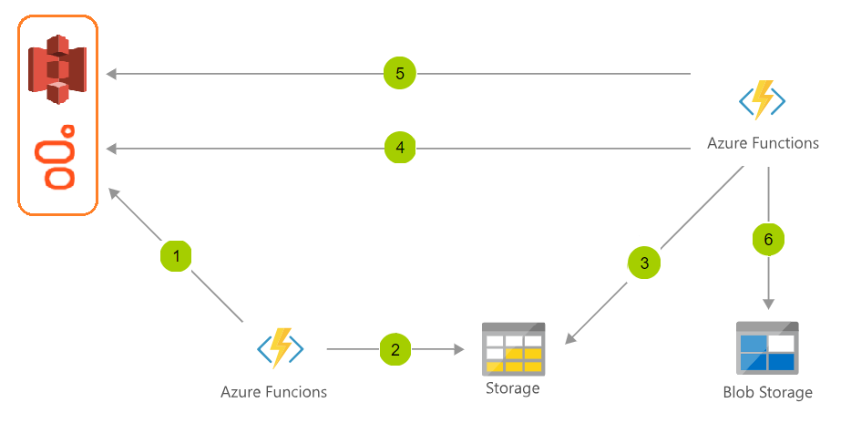

# PureCloud Utils (Azure Functions)

## Summary
* [Purpose](#purpose)
* [Solution](#solution)
* [Steps](#steps)
* [Dependencies](#dependencies)
* [Test](#test)
* [References](#references)
* [Contribution](#Contribution)

## Purpose
Add utilities to PureCloud using Azure functions.

## Solution


## Steps
1. Get conversations by interval
2. Send conversations storage table
3. Read non processed conversation
4. Batch call recording donwload, until success job response
5. Get audio file in s3 storage
6. Upload to blob storage

## Info
Example of actual PureCloud Recording Audio URL:  
* https://apps.mypurecloud.com/directory/#/engage/admin/interactions/interactionId  
We will update to Azure Storage URL:  
* https://storageaccount.blob.core.windows.net/container/conversationIdBlob

## Dependencies
1. [Work with Azure Functions Core Tools](https://docs.microsoft.com/en-us/azure/azure-functions/functions-run-local)
2. [Use the Azure storage emulator for development and testing](https://docs.microsoft.com/en-us/azure/storage/common/storage-use-emulator)
3. [Microsoft.Azure.WebJobs.Extensions.Storage](https://www.nuget.org/packages/Microsoft.Azure.WebJobs.Extensions.Storage)
4. [Microsoft.Azure.WebJobs.Script.ExtensionsMetadataGenerator](https://www.nuget.org/packages/Microsoft.Azure.WebJobs.Script.ExtensionsMetadataGenerator/)
5. [Microsoft.NET.Sdk.Functions](https://www.nuget.org/packages/Microsoft.NET.Sdk.Functions/)
6. [Microsoft.NETCore.App](https://www.nuget.org/packages/Microsoft.NETCore.App)
7. [Newtonsoft.Json](https://www.nuget.org/packages/Newtonsoft.Json/)

## Test
Start Azure storage emulator localy:
```
$ storageemulator.bat
```
Start function:
```
$ cd .\src\PureCloud.Utils.Function\RecordingBulkDownload.TimerTrigger\
$ func start
```

## References
1. [Azure Functions Documentation](https://docs.microsoft.com/en-us/azure/azure-functions/)
2. [Create your first function using Visual Studio Code](https://docs.microsoft.com/en-us/azure/azure-functions/functions-create-first-function-vs-code)
3. [PureCloud Conversation](https://developer.mypurecloud.com/api/rest/v2/conversations/)
4. [PureCloud Recording](https://developer.mypurecloud.com/api/rest/v2/recording/)

## Contribution
If you want to contribute, please read more about markdown tags to edit README file, in [Syntax guidance for Markdown usage](https://docs.microsoft.com/en-us/vsts/project/wiki/markdown-guidance?view=vsts).
